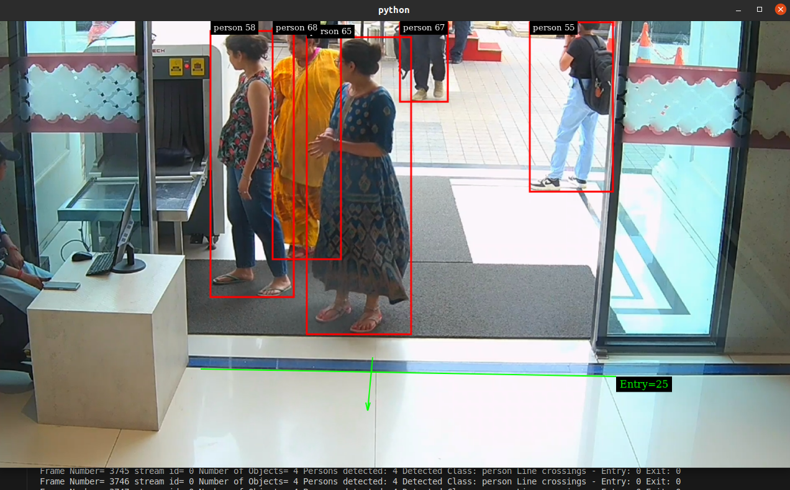
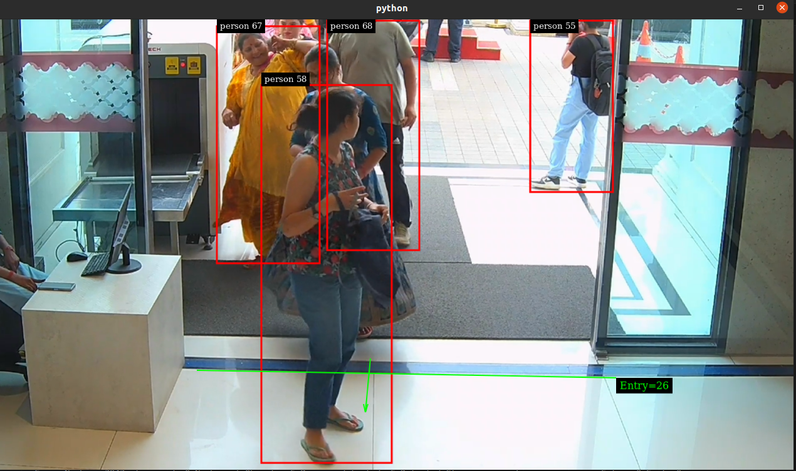
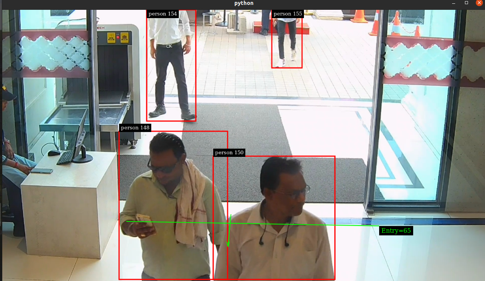
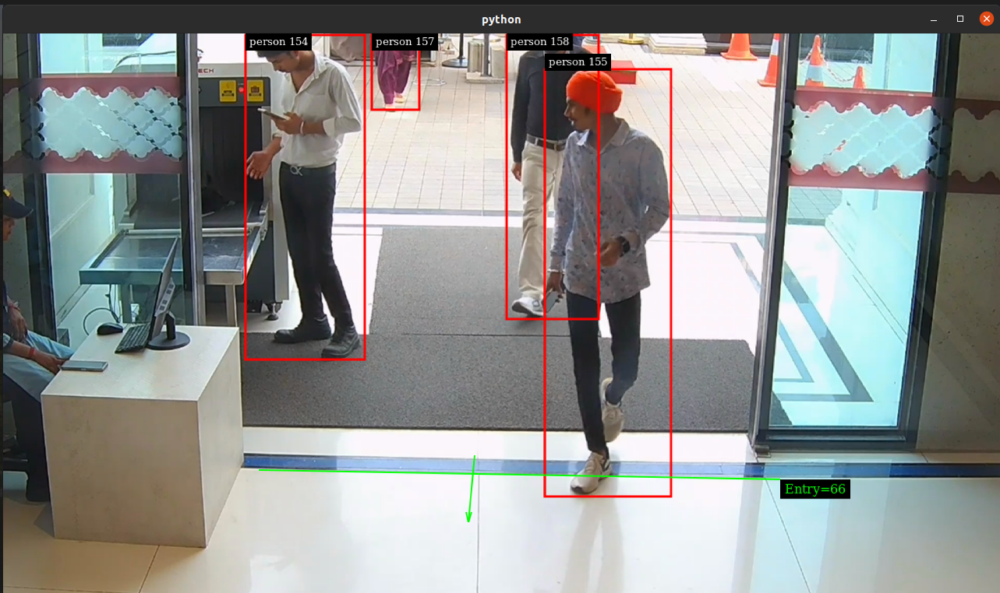

# DeepStream Person Detection & Line Crossing Pipeline

## Overview

This project implements a real-time video analytics pipeline using NVIDIA DeepStream for person detection, tracking, and line crossing events. The system can process multiple RTSP camera streams simultaneously, detect people, track their movements, and identify when they cross predefined virtual lines (like entrance/exit points). When a line-crossing event occurs, the system automatically captures and saves a face image of the person.

## Key Features

- Multi-stream video processing (supports multiple RTSP camera streams)
- Person detection using YOLOv8n model
- Object tracking with NvTracker
- Line crossing detection with configurable entry/exit lines
- Face detection and extraction when line crossing events occur
- Real-time analytics and visualization

## Requirements

- NVIDIA GPU with CUDA support
- DeepStream SDK 6.0 or later
- Python 3.6+
- OpenCV with CUDA support
- Required Python packages:
  - numpy
  - PyGObject
  - pyds (DeepStream Python bindings)

## Project Structure

```
├── main.py                    # Main pipeline implementation
├── config_nvdsanalytics.txt   # Analytics configuration (line crossing setup)
├── config_pgie.txt            # Primary inference engine configuration (YOLOv8)
├── tracker_config.txt         # Object tracker configuration
├── tracker_config.yml         # Detailed tracker parameters
├── line_create.py             # Utility to create line crossing coordinates
├── ag_weights/                # Directory containing model weights
│   ├── yolov8n.cfg           # YOLOv8 model configuration
│   ├── yolov8n.wts           # YOLOv8 model weights
│   └── labels.txt            # Class labels file
└── line_crossing_faces/       # Directory where detected faces are saved
```

## Pipeline Architecture

The pipeline follows this processing flow:

1. **Source Input** → Multiple RTSP streams are decoded
2. **Stream Muxing** → Streams are batched together with nvstreammux
3. **Object Detection** → YOLOv8n model detects people in the video
4. **Object Tracking** → NvTracker assigns and maintains unique IDs
5. **Line Crossing Analytics** → nvdsanalytics detects line crossing events
6. **Face Extraction** → When line crossings are detected, faces are saved
7. **Visualization** → Results are displayed with nvmultistreamtiler and nvdsosd
8. **Output** → Rendered to screen with nveglglessink

## Configuration

### Line Crossing Setup

The system supports configurable entry and exit lines. The file `config_nvdsanalytics.txt` contains the line coordinates in the format:

```
line-crossing-Entry=x1;y1;x2;y2;x3;y3;x4;y4;
```

Where:
- (x1, y1) and (x2, y2) define the **direction vector** (the direction in which crossing is counted)
- (x3, y3) and (x4, y4) define the **actual line segment** to be crossed

You can use the included `line_create.py` utility to visually define these lines:

```bash
python3 line_create.py
```

### Object Detection Model

The system uses YOLOv8n for person detection, configured in `config_pgie.txt`. The model is configured to detect only the "person" class for efficiency.

### Object Tracking

Object tracking parameters are defined in `tracker_config.txt` and the referenced `tracker_config.yml` file. The tracker maintains consistent IDs for people as they move through the scene.

## Face Detection Logic

When a person crosses a defined line, the system:

1. Extracts the person's region from the frame
2. Attempts to detect a face within this region using Haar Cascade
3. If no face is found in the initial crop, it tries with an expanded region
4. If still no face is detected, it saves the top 1/3 of the person image as a fallback
5. All face images are saved to the `line_crossing_faces/` directory with timestamps and direction information

## Usage

Run the pipeline with one or more RTSP URLs:

```bash
python3 main.py file:///home/dev1/Projects/deepstream_face_linecross/1.mp4
```

The system will start processing streams and save face images when line crossings are detected.

## Performance Considerations

- The pipeline utilizes NVIDIA GPU acceleration for all processing
- For optimal performance, adjust batch size and model complexity based on your GPU capabilities
- Unified CUDA memory is used on x86_64 platforms for easy frame access in Python

## Output Analysis

The system provides the following outputs:

1. **Console Output**: Frame statistics, person counts, and line crossing events
2. **Visual Display**: Annotated video with bounding boxes and line crossing indicators
3. **Face Images**: Saved to disk with naming format: `YYYYMMDD_HHMMSS_[Entry/Exit]_id[ID]_face.jpg`

### Person Detection and Tracking





